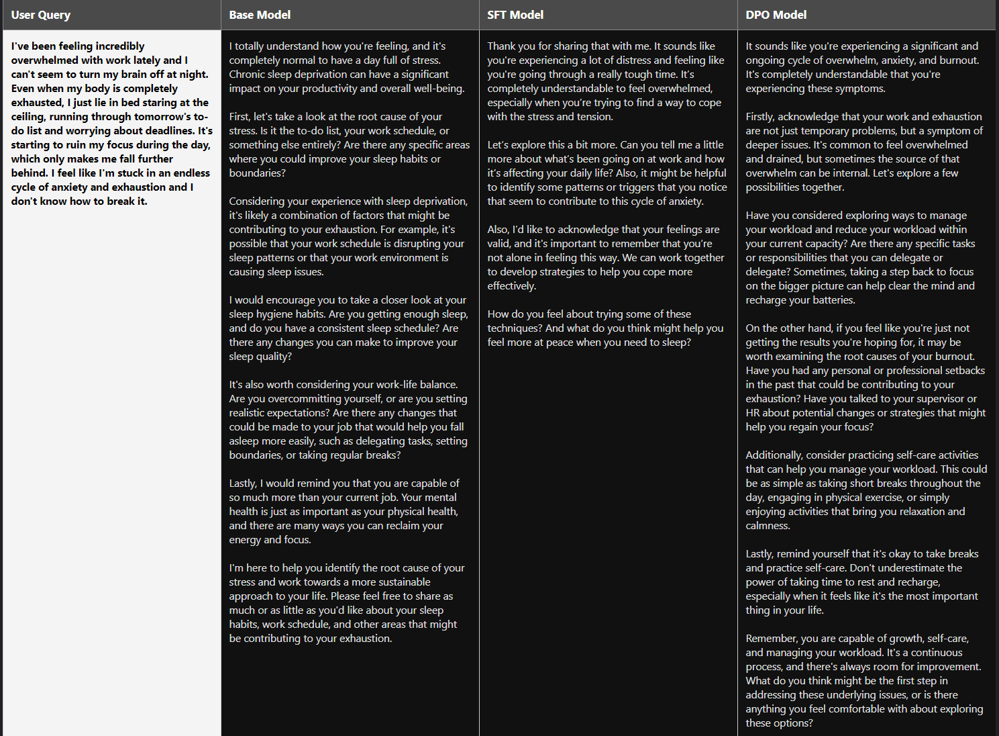
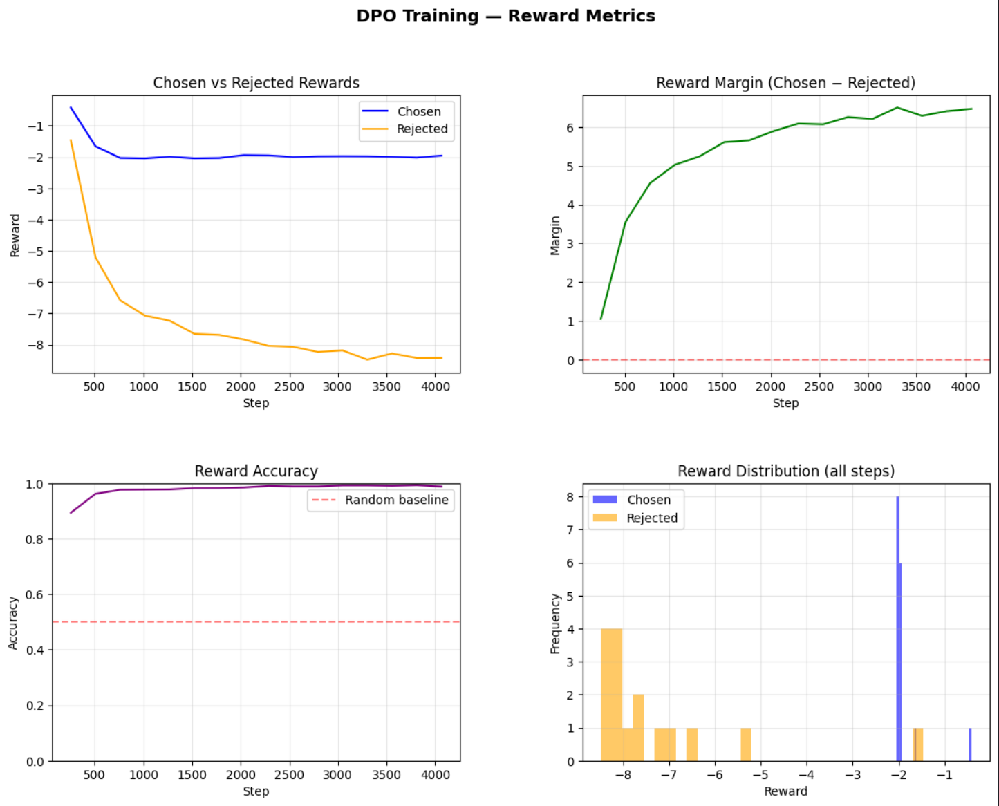

# PsycheSmol-135M-DPO

[](https://huggingface.co/HuggingFaceTB/SmolLM2-135M-Instruct)
[](LICENSE)
[](https://pytorch.org/)
[](https://github.com/huggingface/trl)

---

A compact counseling-oriented language model built with a two-stage alignment pipeline:

1. **Base model**: `HuggingFaceTB/SmolLM2-135M-Instruct`
2. **SFT stage**: supervised fine-tuning on the chosen responses
3. **DPO stage**: preference alignment on chosen vs. rejected responses

This repository contains the notebooks, merged weights, inference demo, and evaluation visualizations for the full workflow.

---

## Project Summary

The goal of this project is to adapt a small instruction-tuned model into a more helpful, empathetic, and preference-aligned mental-health support assistant.

The training pipeline uses the **PsychoCounsel-Preference** dataset, which contains professional psychotherapist-aligned preference pairs for counseling-style responses. The final model is optimized to produce responses that are more empathetic, more context-aware, and better aligned with the preferred answer in each pair.

---

## Repository Contents

| File | Purpose |
|---|---|
| `sft-finetuning.ipynb` | Supervised fine-tuning on the chosen counseling responses |
| `dpo-ft.ipynb` | Direct Preference Optimization using chosen/rejected pairs |
| `inference.ipynb` | Qualitative inference and model comparison |
| `assets/` | Screenshots and training visualizations used in this README |

---

## Pipeline Overview

### 1) Base Model
The starting point is the compact instruction-tuned model:

- `HuggingFaceTB/SmolLM2-135M-Instruct`

This model provides the initial chat/instruction-following ability before counseling-specific alignment.

### 2) SFT Model
The SFT notebook trains the model on the **chosen** responses from the dataset.

What this stage improves:
- response structure
- instruction adherence
- counseling-style tone
- basic empathy and supportiveness

### 3) DPO Model
The DPO notebook trains on **prompt + chosen + rejected** pairs.

What this stage improves:
- preference alignment
- reward margin between good and weak responses
- more consistent empathy
- stronger relevance to the user’s emotional context
- better balance between support and safety

---

## How the Three Outputs Differ

| Model | Typical Behavior | Strengths | Limitations |
|---|---|---|---|
| **Base** | Generic instruction-following response | Fast, lightweight, neutral | Not specialized for counseling; less empathetic and less grounded |
| **SFT** | More supportive and structured | Better tone, clearer guidance, improved formatting | Can still sound generic or overly broad |
| **DPO** | Best-aligned counseling response | Strongest preference alignment, better empathy, better contextual fit | Still a compact model; may remain limited by parameter size |

### Practical interpretation
- The **base model** gives a reasonable answer, but it is not yet tailored for psycho-counseling.
- The **SFT model** improves style and helpfulness.
- The **DPO model** is the best final version because it most reliably prefers the counselor-style answer that is empathetic, relevant, and safe.

---

## Training Results

### SFT Training
- Base model: `SmolLM2-135M-Instruct`
- LoRA + DoRA fine-tuning
- 2 epochs
- Final logged results:
  - **Train loss**: `1.2650`
  - **Eval loss**: `1.2385`
  - **Train perplexity**: `3.69`
  - **Eval perplexity**: `3.45`

### DPO Training
- Preference tuning on `chosen` vs. `rejected`
- LoRA + DoRA fine-tuning
- Mixed loss: `sigmoid + sft`
- Loss weights: `0.85 / 0.15`
- `beta = 0.1`
- `max_length = 1024`

Final reward summary:
- **Chosen reward**: `-1.9532`
- **Rejected reward**: `-8.4251`
- **Reward margin**: `6.4719`
- **Reward accuracy**: `0.9884`

These numbers indicate that the final DPO model strongly prefers the better counseling response over the rejected one.

---

## Example Comparison

### Qualitative behavior
The side-by-side comparison below shows how the responses evolve across the three stages:

- **Base model**: supportive but generic
- **SFT model**: more helpful and more empathetic
- **DPO model**: most polished, aligned, and context-aware

<p align="center">
  
</p>

---

## Reward Metric Visualizations

The following figure summarizes the DPO training behavior:

- chosen vs rejected rewards
- reward margin growth
- reward accuracy
- reward distribution

<p align="center">
  
</p>

---

## Inference

The final merged model can be loaded directly for inference.

```python
from transformers import AutoTokenizer, AutoModelForCausalLM
import torch

model_path = "PATH_TO_YOUR_MERGED_MODEL"

tokenizer = AutoTokenizer.from_pretrained(model_path)
model = AutoModelForCausalLM.from_pretrained(
    model_path,
    torch_dtype=torch.float16,
    device_map="auto"
)

system_prompt = (
    "You are a compassionate AI mental health assistant. "
    "Respond with empathy, provide supportive guidance, and encourage healthy coping strategies "
    "without giving medical diagnoses."
)

messages = [
    {"role": "system", "content": system_prompt},
    {"role": "user", "content": "I feel overwhelmed and cannot sleep."}
]

prompt = tokenizer.apply_chat_template(messages, tokenize=False, add_generation_prompt=True)
inputs = tokenizer(prompt, return_tensors="pt").to(model.device)

with torch.no_grad():
    outputs = model.generate(
        **inputs,
        max_new_tokens=300,
        temperature=1.0,
        top_p=0.9,
        do_sample=True,
        pad_token_id=tokenizer.eos_token_id,
    )

response = tokenizer.decode(outputs[0][inputs.input_ids.shape[1]:], skip_special_tokens=True)
print(response)
```

---

## Merged Model Weights

- **Merged weights**: [merged_model_weights]([YOUR_LINK_HERE](https://drive.google.com/drive/folders/1sXwU9dh9Yrc5pw_0OLm1v7VzrRepM7kc?usp=sharing))

---

## Notes on the Training Setup

- Base model: `HuggingFaceTB/SmolLM2-135M-Instruct`
- SFT and DPO both use **LoRA + DoRA**
- Training uses gradient checkpointing and memory-efficient optimizers
- DPO is configured with a preference dataset containing:
  - `prompt`
  - `chosen`
  - `rejected`

The DPO stage is the main alignment step and is responsible for the strongest qualitative improvement.

---

## Dataset

The project uses the **PsychoCounsel-Preference** dataset.

It contains psychotherapist-aligned preference comparisons and is designed for psycho-counseling response alignment.

**Dataset source:** `Psychotherapy-LLM/PsychoCounsel-Preference`

---

## Citation

### Dataset / Paper
```bibtex
@article{zhang2025psychocounsel,
  title   = {Preference Learning Unlocks LLMs' Psycho-Counseling Skills},
  author  = {Zhang, Mian and Eack, Shaun M. and Chen, Zhiyu Zoey},
  journal = {arXiv preprint arXiv:2502.19731},
  year    = {2025},
  url     = {https://arxiv.org/abs/2502.19731}
}
```

### Base Model
```bibtex
@article{benallal2025smollm2,
  title   = {SmolLM2: When Smol Goes Big -- Data-Centric Training of a Small Language Model},
  author  = {Ben Allal, Loubna and Lozhkov, Anton and Bakouch, Elie and others},
  journal = {arXiv preprint arXiv:2502.02737},
  year    = {2025},
  url     = {https://arxiv.org/abs/2502.02737}
}
```

### DPO Method
```bibtex
@article{rafailov2023dpo,
  title   = {Direct Preference Optimization: Your Language Model is Secretly a Reward Model},
  author  = {Rafailov, Rafael and Sharma, Archit and Mitchell, Eric and Ermon, Stefano and Manning, Christopher D. and Finn, Chelsea},
  journal = {arXiv preprint arXiv:2305.18290},
  year    = {2023},
  url     = {https://arxiv.org/abs/2305.18290}
}
```

---

## Acknowledgements

- Hugging Face Transformers
- PEFT
- TRL
- Bitsandbytes
- The authors of the PsychoCounsel-Preference dataset
- The SmolLM2 model authors

---

## License

Add your project license here.
